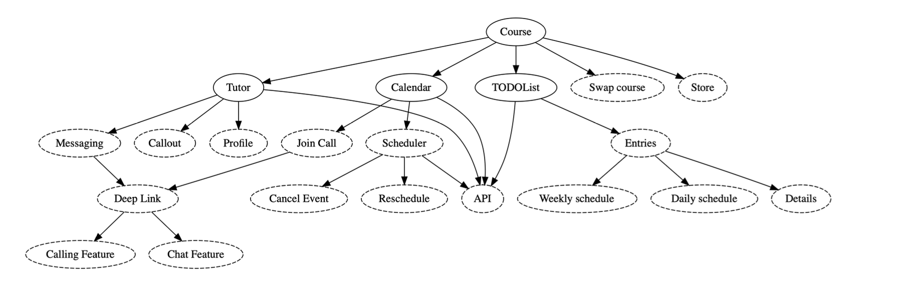
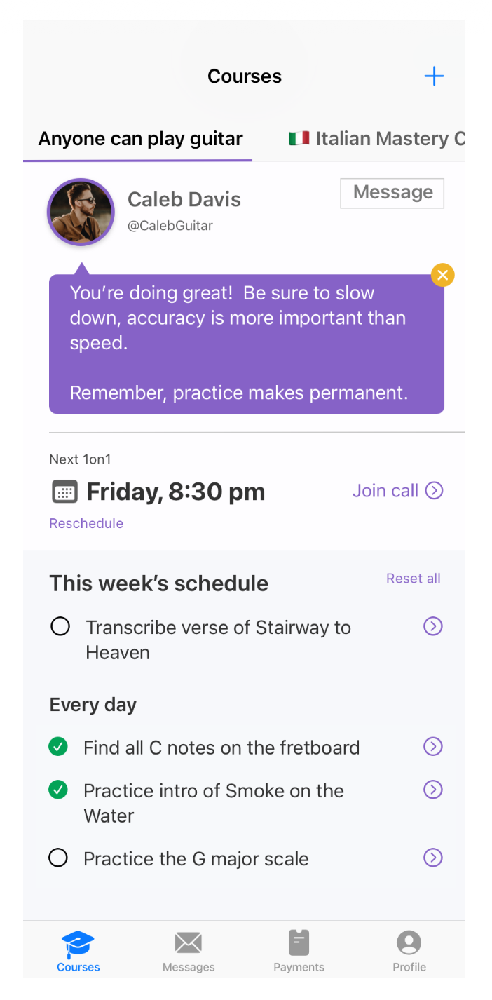

# Chapters

- **Chapter 1: About This Book** This chapter introduces the common challenges of mobile development and explains how System Design can help engineers navigate them
. You will learn to focus on timeless principles rather than fleeting trends to build a strong foundation
. It also helps you distinguish between system design and software architecture to better satisfy real-world business requirements
.
- **Chapter 2: Turning a Briefing Into a Strong Plan** This chapter focuses on how to handle project briefings by uncovering hidden requirements and testing edge cases
. You will learn how to sketch out a technical landscape diagram to structure your app, even when missing crucial information
. It also teaches you how to effectively communicate with designers and backend developers to form a solid, time-saving starting point
.
- **Chapter 3: Holistic-Driven Development;** Turning a Plan Into Code Here, you learn how to take a holistic approach to deliver a working feature quickly without getting bogged down by details
. It focuses on designing components and APIs using concrete types and placeholder code rather than over-engineering with interfaces
. You will understand how quickly jumping between components ensures you maintain momentum and keep the highest priorities in mind
.
- **Chapter 4: System-Wide Testing;** Delivering Higher Quality Apps This chapter challenges the status quo of testing the smallest isolated units by advocating for the use of fewer interfaces
. You will learn how to test your system on a larger scope to get quality guarantees much earlier in the development process
. As a bonus, it demonstrates how you can effectively test more application surfaces by writing significantly less code
.
- **Chapter 5: Cross-Domain Testing;** Testing More With Less Effort Expanding on system-wide testing, this chapter explores how to efficiently test across multiple domains
. You will learn to identify which domains are volatile and which are stable, allowing you to invest your testing efforts where they matter most
. It also covers how to establish boundaries so you know where to fix issues and manage responsibilities during cross-domain testing
.
- **Chapter 6: Dependency Injection** Foundations This chapter dives into the core reasons why dependency injection is necessary for modern mobile apps
. It provides fresh perspectives on dealing with singletons, illustrating how they can hinder modularization and compromise thread safety
. You will also learn to identify the specific scenarios where singletons actually make sense to implement
.
- **Chapter 7:** Sane Dependency Injection Without Fancy Frameworks This section teaches you how to pass dependencies around using straightforward, vanilla code instead of relying on "magical" third-party frameworks
. You will learn how to resolve the "ABC problem" (where classes are unnecessarily aware of transitive dependencies) by flipping your dependency hierarchy inside out
. It also covers using lazy loading techniques and factories for dependencies that cannot be created upfront
.
- **Chapter 8:** Dependency Injection on a Larger Scale Moving beyond local features, this chapter handles dependencies within larger code-hierarchies and highly modular apps
. You will learn how to weave dependencies across many types and reduce giant dependency trees into manageable, bite-sized pieces
. It also covers the unique challenges of passing dependencies across module boundaries while intentionally keeping public interfaces small
.
- **Chapter 9:** UI Frameworks, Architectures, and Supporting Multiple Products This chapter emphasizes treating features like self-sustained command-line tools to strictly decouple business logic from the UI
. You will learn why UI architectures are less critical than advertised and how delaying UI implementation gives you better flexibility
. Ultimately, you will be able to reason about codebases that must survive migrations and support multiple platforms or UI paradigms
.
- **Chapter 10:** Delivering Reusable Views; The Art of Decomposing a Design Here, you learn the art of breaking down a design into reusable components that can instantly form the basis of a UI library
. It strongly focuses on proper naming conventions to ensure components remain completely decoupled from specific business logic
. You will understand how to balance abstractions and avoid over-engineering when creating generic view primitives
.
- **Chapter 11:** Reasoning About Views, Components, Screens, and Bindings This chapter explores the philosophical and practical differences between views, view components, and feature views (screens)
. You will learn various approaches for connecting these views to business logic, evaluating UI patterns like viewmodels along the way
. It will equip you to decide exactly where complexity should live and when a component truly needs to be reusable
.
- **Chapter 12:** Pragmatically Implementing UI Taking a highly practical approach, this chapter guides you through the step-by-step implementation of a screen using both declarative and imperative paradigms
. You will learn the trade-offs between top-down and bottom-up approaches in relation to Holistic-Driven Development
. The core lesson is to deliver a functionally working UI using placeholders before getting distracted by exact styling and margins
.
- **Chapter 13:** Delivering Self-Sufficient Features, Part I: The Art of Staying Nimble This chapter introduces the concept of self-sufficient features that can operate independently without micromanagement from parent views
. You will learn how to design features that handle their own errors gracefully and load their own data through composition rather than extension
. It also explains how these features avoid mutating their parent's navigation stack, keeping your codebase highly agile
.
- **Chapter 14:** Delivering Self-Sufficient Features, Part II; Self-Loading Features Building on the previous chapter, you will learn how to make features completely self-loading by heavily utilizing ID lookups
. This enables you to easily "cut and paste" a feature across different modules or flows within an app since they require fewer dependencies
. As a bonus, it demonstrates how this standalone approach makes supporting deep-linking nearly effortless
.
- **Chapter 15:** Delivering Self-Sufficient Features, Part III; Making Features Portable This chapter focuses on pushing logic out of the UI domain and into the model domain to create highly portable features
. You will learn how portable features can survive UI migrations and operate independently across different platforms and paradigms
. Crucially, this approach transforms the model into the source-of-truth, allowing you to unit-test a much larger surface area without relying on manual UI testing
.
- **Chapter 16:** Reusing Views Across Flows Here, you tackle the common caveats that prevent views from being successfully reused across multiple navigation flows
. You will learn to implement solutions using closures, navigation interfaces, and declarative APIs to decouple views from their parents
. By the end, you will understand how to design views that remain completely oblivious to their surrounding navigation, leaving routing logic strictly to the parent
.
- **Chapter 17:** Taming Complex UI This chapter addresses views that become monolithic "big balls of glue" overburdened with states, async operations, and user interactivity
. By examining paradigms like pagination and Bento-Box UI, you will learn how to push complexity deeper into sub-views to create better structural hierarchies
. It highlights how disconnecting UI rendering from feature logic makes monolithic screens much more manageable
.
- **Chapter 18:** Crafting Robust and Reusable Navigation Flows Moving beyond simple views, this chapter explores the philosophy behind designing effective navigation flows
. You will learn to treat a flow like a story, focusing on its ultimate purpose and return value rather than its internal steps
. This mindset will help you build navigation APIs that are robust, highly reusable, and completely abstracted from their parent components
.
- **Chapter 19:** Design System or Not; How a UI Library Lays the Groundwork This chapter clarifies the distinction between a simple UI library and a full-fledged design system
. You will learn the benefits and challenges of introducing a design system and how to start organically with a UI library to avoid a massive upfront investment
. It provides strategies for standardizing design decisions to improve collaboration between designers and developers, rather than treating designs as strict blueprints
.
- **Chapter 20:** UI Library Fundamentals, Part I: Typography and Colors Focusing on the lowest level of abstraction, this chapter teaches you how to build the foundational elements of a UI library
. You will learn to separate raw primitive values (like specific hex codes or font weights) from semantic styles (like "body text" or "primary background") to give your UI meaning and flexibility
. Ultimately, this approach makes app-wide theming, variations, and design updates incredibly simple to maintain globally
.

## 1.6 What to expect during Mobile System Design interviews
- If you’re applying for a junior, SW I or SW II level, job, you can expect to
receive UI and feature specifications to come up with a technical design.
For example, the interviewer might ask: “How would you build a screen
that downloads and displays a list of workouts in a gym app?”
While modeling this feature, you’ll cover topics such as networking,
testing, and how to decouple UI from business logic.

- When interviewing for a senior level, expect the questions to become more
broad or “larger scale”. The interviewers might look for signals that you
deliver a feature that serves larger flows and multiple use-cases.
Alternatively, they might ask how you would make a feature reusable
across the entire application or multiple targets. This will touch on topics
such as architectures, interfaces, generic code, domain modeling, and
dependency injection. You can also expect to be asked about more
complicated topics, such as downloading large amounts of local data,
caching, or security.

- If you’re applying for an even higher position, such as a staff engineer,
expect to go more grand-scale. At this level, expect having to come up with
solutions ranging from building features all the way to release management.
Interviewers may ask what is required to scale up the feature so that it can
serve all teams, multiple targets, platforms, and domains.

## 2.2.7 A recommended approach on Briefing into a Strong Plan

- Many valid ways exist to attack this difficult problem. You must understand the problem better at the first stage. This step helps uncover wrong assumptions and missing features

- Do not get lost in the details right now. You only need a general outline of what is required. This outline helps deal with many unknown requirements

- Avoid starting with fancy drop shadows and animations. You can defer architecture discussions until much later. You should begin by drawing a diagram

## NOTES

- During System Design interviews, you can’t go back and forth with a designer. But you can communicate the unknown details and missing information. This shows the interviewers that you’re understanding the problem on a deeper level, and are considering edge-cases.

- During a job interview, it’s important to show all the missing details that you’re thinking of. It’s a way to impress interviewers by showing you think of a lot of non-obvious parts and secondary requirements.

- if you have trouble getting your code to compile during an interview, then say it’ s “intentional” so you can focus on more important parts.
