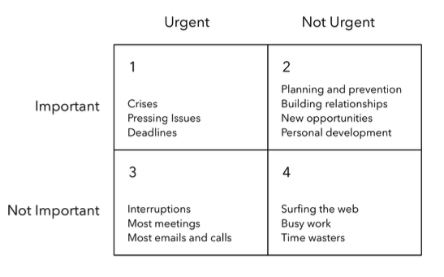

# The Effective Engineer 

## Chapter 1: Focus on High-Leverage Activities

### Why
Among the list of tasks we need to find the important one to finish first that will benifit us most.

### How to focus
To find the most important task we can use below formula to calculate Leverage which is equivalent to **return on investment (ROI)** for the effort that’s put in:

***Leverage = Value, or impact, produced / Time invested***

- Three ways to increase the **leverage:**
    - By reducing the time it takes to complete a certain activity.
    - By increasing the output of a particular activity.
    - By shifting to higher-leverage activities.

## Chapter 2: Optimize for Learning

### Why
The tech industry evolves quickly, introducing new tools, frameworks, and methodologies regularly.  It's not just about acquiring new technical skills but also about developing a mindset that embraces learning, growth, and adaptability. In a field where change is constant, engineers who prioritize learning are better positioned to thrive, innovate, and contribute meaningfully to their teams and organizations. It's not just about acquiring new technical skills but also about developing a mindset that embraces learning, growth, and adaptability. In a field where change is constant, engineers who prioritize learning are better positioned to thrive, innovate, and contribute meaningfully to their teams and organizations.

### How to Optimize
- Need to adopt a growth mindset rather than fixed mindset. 
- View failures and challenges through a growth mindset, and see them as opportunities to learn.
- Invest time regularly for learning or doing side project. Can follow 20% rule which states we should dedicate our 20% work time for learning.
- Learning compounds like interest. The more you learn, the easier it is to apply prior insights and lessons to learn new things.
- Capitalize on opportunities at work to improve your technical skills. 
- Learn from your best coworkers. Study their code and their code reviews. 
- Dive into any available educational material provided by your company, and look into classes or books that your workplace might be willing to subsidize

## Chapter 3: Prioritise regularly

*Prioritization is hard work, and like most skills, it requires practice. We need to work persistently on improving our prioritization skills. Taking the time and energy to prioritize will significantly increase your chances for success.*

### How to prioritize
Some strategies used to prioritize effectively:
- **Track To-Dos in a single, easily accessible list.** The first step in effective prioritization is listing every task that you might need to do and prioritizing them, rather than relying on memory.
- **While prioritizing, ask yourself: Is there something else I could be doing that's higher-leverage? If not, continue on your current path. If yes, it's time to rethink what you're doing.**
	- To determine whether something else offers greater leverage than your current efforts, you can follow two key heuristics:
		- *Focus on activities that directly produce value. Prioritize those that yield the most value with the least effort.*
		- *Prioritize the important and non-urgent tasks. In addition to focusing on activities that directly generate value, consider prioritizing investments that enhance your effectiveness and enable you to deliver more value in the future.*

- Protect Your Maker’s Schedule. When possible, preserve larger blocks of focused time in your schedule.
- **Limit the amount of work in progress.**
	- When we fragment our attention too much, however, we end up reducing our overall productivity and hindering our ability to make substantive progress on any single task. Constantly switching contexts hinders deep engagement in any one activity and reduces our overall chances of success. Therefore, we need to be deliberate about limiting our work in progress. This involves prioritizing and sequencing different projects so that we can maintain a strong momentum.
- **Fight procrastination with If-Then plans.**
	- Many people do not have sufficient motivation to summon the activation energy required to start a difficult task. The 'if-then' plan, in which we identify ahead of time a situation where we plan to do a certain task, is essential. Subconscious follow-up is important because procrastination primarily stems from a reluctance to expend the initial activation energy on a task. This reluctance leads us to rationalize why it might be better to do something easier or more enjoyable, even if it has lower leverage. When we're in the moment, the short-term value that we get from procrastinating can often dominate our decisionmaking process. However, when we make 'if-then' plans and decide what to do ahead of time, we're more likely to consider the long-term benefits associated with a task.

- **Make a routine of prioritization**
	- As time passes, our current projects may no longer represent the best use of our time, so we need to make a habit of revisiting those priorities.

## Chapter 4: Invest in Iteration Speed

### Why

- The faster that we can iterate, the more that we can learn about what works and what doesn’t work. 
- We can build more things and try out more ideas. [Not every change will produce positive value and growth, of course.]

### How to invest

### Invest in Time-Saving Tools

- If we have to do something manually more than twice, then it is better to write a tool for the third time. There are only a finite number of work hours in the day, so increasing our effort as a way to increase our impact fails to scale. Tools are the multipliers that allow us to scale our impact beyond the confines of the work day.
- Improve internal development tools.

### Shorten Your Debugging and Validation Loops

- We can shortcut around normal system behaviors and user interactions when we’re testing our products.
	- We could navigate through the same three interactions that every normal user goes through: switching to the friends tab, choosing someone from our contacts, and then crafting an invite message. Or, we could create a much shorter workflow by spending a few minutes wiring up the application so that you’re dropped into the buggy part of the invitation flow every time the application launches.

### Master Your Programming Environment

Mastery is a process, not an event, and as you get more comfortable, the time savings will start to build. The key is to be mindful of which of your common, everyday actions slow you down, and then figure out how to perform those actions more efficiently. Here are some ways we can get started on mastering our programming fundamentals:
- Get proficient with your favorite text editor or IDE.
- Learn at least one productive, high-level programming language.
- Get familiar with UNIX (or Windows) shell commands.
- Prefer the keyboard over the mouse.
- Automate your manual workflows.
- Test out ideas on an interactive interpreter. For example in iOS development test your logical code in Playground or Console app before tesing it in app environment.
- Make it fast and easy to run just the unit tests associated with your current changes.

### Don’t Ignore Your Non-Engineering Bottlenecks

Non-engineering constraints may also hinder your iteration speed. 
- One common type of bottleneck is dependency on other people. A product manager might be slow at gathering the customer requirements that you need; a designer might not be providing the Photoshop mocks for a key workflow; another engineering team might not have delivered a promised feature, thus blocking your own development.
	- Communication is critical for making progress on people-related bottlenecks. Ask for updates and commitments from team members at meetings or daily stand-ups. Periodically check in with that product manager to make sure what you need hasn’t gotten dropped. Follow up with written communication (email or meeting notes) on key action items and dates that were decided in-person.
	- Don’t wait until after you’ve invested massive amounts of engineering time to seek final project approval. Instead, prioritize building prototypes, collecting early data, conducting user studies, or whatever else is necessary to get preliminary project approval.

## Chapter 5: Measure What You Want to Improve

### Why

Measuring what you want to improve is fundamental because it provides direction, enables informed decision-making, and facilitates continuous improvement. Without measurement, progress is difficult to track, goals become ambiguous, and improvement efforts lack focus. By establishing clear metrics aligned with objectives, teams can effectively track progress, identify areas for enhancement, and make data-driven decisions to drive success and innovation.

### How to measure

#### Use Metrics to Drive Progress
Good metrics accomplish a number of goals. First, they help you focus on the right things. They confirm that your product changes and all the effort you’ve put into them—actually achieve your objectives. it also helps guarding against future regressions. For example: bug fix turnaround time, website traffic and conversion rates, failed signup rate etc.

We’ll often be faced with tricky situations where intuitively something seems valuable, but it is hard to quantify or takes too much effort to measure. In that case ask yourself: 

- Is there some way to measure the progress of what I’m doing?
- If a task I’m working on doesn’t move a core metric, is it worth doing? Or is there a missing key metric?

#### Pick the Right Metric to Incentivize the Behavior You Want

It’s crucial to remember that the choice of which metric to measure dramatically impacts and influences the type of work that we do. Tracking different metrics can affect team behavior differently.

An examples of how tracking different metrics can affect team behavior:

- **Hours worked per week vs. productivity per week**
	- The writer observed during his early job life, attempting to increase output by increasing hours worked per week is unsustainable. It is much more reasonable to align your metric with productivity per week, where productivity in your focus area is measured by factors like product quality, site speed, or user growth.

#### Instrument Everything to Understand What’s Going On
- The principle of "Instrument Everything to Understand What’s Going On" advocates for comprehensive data collection through instrumentation. By collecting diverse and granular data, teams gain insights into system performance, user behavior, and areas needing improvement. Instrumentation forms the foundation for data-driven decision-making and continuous improvement, fostering a deeper understanding of complex systems and processes. For example: when it comes to diagnosing problems, instrumentation is critical. Suppose there’s a spike in the number of user login errors. Was a new bug introduced? Did the authentication backend hit a network glitch? Was a malicious user programmatically guessing passwords? Was it something else entirely? To effectively answer these questions, we need to know when the errors started, the time of the latest code deployment, the network traffic of the authentication service, the maximum number of authentication attempts per account over various time windows, and possibly more pieces of information. Without these metrics, we’re left guessing—and we might end up wasting effort addressing non-problematic areas.
- Adopting a mindset of instrumentation means ensuring we have a set of dashboards that surface key health metrics and that enable us to drill down to the relevant data. However, many of the questions we want to answer tend to be exploratory, since we often don’t know everything that we want to measure ahead of time. Therefore, we need to build flexible tools and abstractions that make it easy to track additional metrics.

#### Internalize Useful Numbers

- "Internalize Useful Numbers" emphasizes the significance of understanding and internalizing key metrics relevant to one's work. By grasping the context, significance, and implications of these numbers, engineers and teams can make informed decisions, drive improvements, and create a data-driven culture that facilitates better outcomes and efficiency. Understanding and leveraging these metrics effectively can significantly contribute to achieving organizational objectives and continuous improvement. For example, accessing 1MB worth of data from memory is 120x faster than accessing the same data from disk, and 40x faster than reading it over a 1 Gbps network. Also, a cheap compression algorithm like Snappy that can compress data by, say, a factor of 2, can halve your network traffic while adding only 50% more latency.
- Internalizing useful numbers can also help you spot anomalies in data measurements.

#### Be Skeptical about Data Integrity
Being skeptical about data integrity involves maintaining a critical mindset towards collected data. It requires understanding data limitations, verifying sources, implementing robust data governance practices, and cross-verifying information to ensure its accuracy and reliability. By adopting a cautious approach, teams can mitigate the risks associated with misleading or erroneous data, making more informed and reliable decisions. Untrustworthy data that gets incorporated into decision-making processes provides negative leverage. It may lead teams to make the wrong decision or waste cognitive cycles second-guessing themselves. Given the importance of metrics, investing the effort to ensure that your data is accurate is high-leverage. Here are some strategies that you can use to increase confidence in your data integrity:
- Log data liberally, in case it turns out to be useful later on
- Build tools to iterate on data accuracy sooner
- Write end-to-end integration tests to validate your entire analytics pipeline
- Examine collected data sooner
- Cross-validate data accuracy by computing the same metric in multiple ways
- When a number does look off, dig in to it early

## Chapter 6: Validate Your Ideas Early and Often

### Why
Validating ideas early mitigates risks and uncertainties. It serves as a reality check, preventing extensive investment in concepts that might not yield desired results. Quick validations enable iterations, allowing adjustments before issues become deeply embedded.

### How to Validate

#### Low-Effort Validation Strategies
Finding low-effort ways to validate work is key. These methods provide quick insights without extensive resource commitments. Techniques like lightweight prototypes, concept sketches, or surveys can swiftly validate core concepts, saving time and resources.

#### A/B Testing for Continuous Validation
Continuously validating product changes via A/B testing is vital. This empirical approach compares versions or features to determine performance differences. It enables data-driven decisions by observing real user behavior and preferences. Direct user input through surveys, interviews, or usability testing offers invaluable insights. Understanding user needs and preferences guides product development towards user-centric solutions.

#### Avoid One-Person Team as much as possible
Beware of relying solely on one-person teams. Collaborative validation, incorporating diverse perspectives and skill sets, is more effective. One-person teams may lack the diverse insights and expertise needed for comprehensive validation.

#### Building Feedback Loops
Building feedback loops for decisions ensures ongoing validation. Incorporating user feedback, data analysis, and insights into decision-making processes creates iterative cycles. These loops enable constant improvements based on validated information. Rather than making an important decision and moving on, set up feedback loops that enable you to collect data and assess your work’s value and effectiveness.

#### Prototyping and MVPs
Prototyping and Minimum Viable Products (MVPs) allow rapid validation. These scaled-down versions facilitate quick feedback, minimizing resource investments while maximizing learning opportunities.

## Chapter 7: Improve Your Project Estimation Skills

### Why

Project estimation is one of the hardest skills that an effective engineer needs to learn. But it’s crucial to master: businesses need accurate estimates to make long-term plans for their products. They need to know when resources might free up to work on upcoming features or when they can promise feature requests to customers. And even when we don’t have pressure to ship against a deadline, how long we think a project will take affects our decisions of what to work on.

### How to Improve

#### Decompose the project into granular tasks
When estimating a large project, decompose it into small tasks and estimate each one of them. If a task will take more than two days, decompose it further. The more granular a task’s breakdown, the less likely that an unconsidered subtask will sneak up later.

#### Base your estimates on task duration, not desired duration
Estimate based on how long tasks will take, not on how long you or someone else wants them to take. It's better to be realistic and considering past experiences or data to determine a more accurate estimation rather than an optimistic or wishful timeframe.

#### Estimates are likelihoods, not best-case views
Because we operate with imperfect information, we instead should consider our estimates as probability distributions over a range of outcomes, spanning the best-case and worst-case scenarios. Instead of telling a product manager or other stakeholder that we’ll finish a feature in 6 weeks, we might instead tell them, “There’s a 50% likelihood that we can deliver the feature 4 weeks from now, and a 90% chance that we can deliver it within 8 weeks.”

#### Task doer makes the estimate
People have different skill sets and levels of familiarity with the codebase. Therefore, what takes you one hour to complete might take someone else three hours. As much as possible, have the person who will work on a task do the actual estimation. Divvying up the estimation work also enables more team members to practice estimation skills and builds team-wide visibility into how different members over or underestimate their work (most people underestimate).

#### Beware of anchoring bias
Avoid committing to an initial number before actually outlining the tasks involved, as a low estimate can set an initial anchor that makes it hard to establish a more accurate estimate later on.

#### Use multiple approaches to estimate the same task
This can help increase confidence that your approach is sound. For example, suppose you’re building a new feature. You can 1) decompose the project into granular tasks, estimate each individual task, and create a bottom-up estimate; 2) gather historical data on how long it took to build something similar; and 3) count the number of subsystems you have to build and estimate the average time required for each one.

#### Beware the mythical man-month
In engineering, project durations typically get measured in terms of person-hours, person-days, person-weeks, or person-months i.e. the number of hours, days, weeks, or months of work that it takes an average engineer to complete a project. Unfortunately, this type of accounting leads to the myth that people and time are interchangeable.

#### Validate estimates against historical data
Data-driven estimates backed by historical evidence are promoted, suggesting the adjustment of overall estimates based on past underestimations or growth patterns. For example, if historical underestimations have been at 20%, scaling up estimates by 25% can provide more accurate projections. Similarly, increased growth rates in users or revenue allow for forecasting future performance based on these observed patterns.

#### Use timeboxing to constrain tasks that can grow in scope
Implement timeboxing to limit the scope of tasks prone to expansion. While researching for new features, the pursuit of perfection in choices like database technologies or JavaScript libraries can lead to diminishing returns and schedule complications. The approach suggests allocating a fixed time, a time box, for openended activities. Instead of estimating a three-day duration for research, commit to making the best decision possible within the available data after three days.

#### Allow others to challenge estimates 
Because estimation is hard, we have a tendency to cut corners or eyeball numbers. By reviewing estimates at a team meeting, we can increase accuracy and buy-in at the cost of some additional overhead. Others may have knowledge or experience that can help highlight poor or incomplete estimates. Iteratively revising our estimates can lead us to better project outcomes. Estimates contain more uncertainty at the beginning of a project, but the variance decreases as we flesh out the details. Use incoming data to revise existing estimates and, in turn, the project plan; otherwise, it will remain based on stale information.

#### Budget for the Unknown
We can better deal with unknowns by acknowledging that the longer a project is, the more likely that an unexpected problem will arise. The first step in dealing with this is to separate estimated work time from calendar time.

#### Define Specific Project Goals and Measurable Milestones
Define specific goals for a project based on the problem you’re working to solve, and then use milestones to measure progress on those goals. The simple exercise of setting a project goal produces two concrete benefits. First, a well-defined goal provides an important filter for separating the must haves from the nice-to-haves in the task list. The second benefit of defining specific project goals is that it builds clarity and alignment across key stakeholders. If we’ve fallen behind, a milestone provides an opportunity to revise our plan, either by extending the deadline or by cutting tasks.

#### Reduce Risk Early
Tackling the riskiest areas first helps us identify any estimation errors associated with them. Our initial project estimates will exhibit high variance because we’re operating under uncertainty and imperfect information. As we gain more information and revise our estimates, the variance narrows. By shifting the work that can take highly variable amounts of time to earlier in the process, we reduce risk and give ourselves more time and information to make effective project plans.

#### Know the limits of overtime
Many teams burn out because they start sprinting before they’re even close to the finish line. Don’t sprint just because you’re behind and don’t know what else to do. Work overtime only if you’re confident that it will enable you to finish on time.

## Chapter 8: Balance Quality with Pragmatism

### Why
Striking a balance between quality and pragmatism is essential. While high-quality solutions are desirable, aiming for perfection in every aspect can lead to inefficiencies, delays, and over-engineering. Embracing pragmatism ensures timely delivery and resource optimization without compromising essential quality standards.

### How to Balance

#### Establish a Sustainable Code Review Process
Code reviews facilitate positive modeling of good coding practices. There’s a tradeoff between the additional quality that code reviews can provide and the shortterm productivity win from spending that time to add value in other ways. Find the right balance between code reviews and tooling to trade off code quality and development speed.

#### Manage Complexity through Abstraction
Invest in good software abstractions to simplify difficult problems. Good abstractions solve a hard problem once and for all, and significantly increase the productivity of those who use it. But if you try to build abstractions when you have incomplete information about use cases, you’ll end up with something clunky and unusable.

#### Automate Testing
Automated testing doesn’t just reduce bugs; it provides other benefits as well. The most immediate payoff comes from decreasing repetitive work that we’d otherwise need to do by hand. Rather than manually triggering variations from different code branches, we can programmatically and quickly run through large numbers of branches to verify correctness. Moreover, the more closely the tests mirror actual conditions in a production environment and the easier it is for engineers to run those tests, the more likely it is that engineers will incorporate testing into their development workflow to automate checks. A suite of unit and integration tests can help alleviate the fear of modifying what might otherwise be brittle code. Focus on ones that save the most time first.

#### Repay Technical Debt
If you spend all your resources paying off interest on your debt, you won’t have enough time left to work on new things. Focus on the debt that incurs the most interest. By doing so, teams can prevent compounding issues, improve system reliability, and maintain agility in future developments. Repaying technical debt is crucial for sustained productivity, reduced maintenance costs, and long-term project success.

## Chapter 9: Balance Quality with Pragmatism

### Why

Reducing operational complexity is crucial for optimizing workflows and resource utilization. It enables teams to focus on innovation rather than being bogged down by mundane operational tasks. Minimizing this burden enhances productivity and ensures a more resilient system.

### How to Minimize

#### Embrace Operational Simplicity
Simplicity in operations is key. Simplifying processes and systems streamlines workflows, making them more manageable and less prone to errors or failures.  Simpler systems are easier to understand, extend, and maintain. When engineering teams don’t focus on doing the simple thing first, they either end up being less effective over time because their energy is spent on a high upkeep cost, or they reach a point where the operational burden gets so high that they’re forced to simplify their architecture.

#### Build Systems to Fail Fast
Developing systems that quickly identify and respond to failures is essential. Embracing a fail-fast approach enables early detection and resolution of issues, reducing downtime and improving system reliability. Bugs are easier to find and fix, so fewer go into production. Failing fast doesn’t necessarily mean crashing your programs for users. You can take a hybrid approach: use fail-fast techniques to surface issues immediately and as close to the actual source of error as possible; and complement them with a global exception handler that reports the error to engineers while failing gracefully to the end user.

#### Relentlessly Automate Mechanical Tasks
Automation is pivotal in reducing manual tasks. By automating routine and repetitive processes, teams can save time and resources, allowing engineers to focus on more strategic and innovative work. Aggressively automate manual tasks to save yourself time. At the same time, think twice before trying to automate decision-making, which tends to be hard to get correct.

#### Make Batch Processes Idempotent
Creating batch processes that are idempotent ensures consistency and reliability. Idempotent processes can be rerun without causing unintended side effects or duplications, reducing the operational complexity associated with batch operations.

#### Hone Your Ability to Respond and Recover Quickly
Developing robust response and recovery capabilities is critical. Being able to swiftly respond to issues and recover from failures minimizes downtime, mitigates potential risks, and ensures operational continuity.
